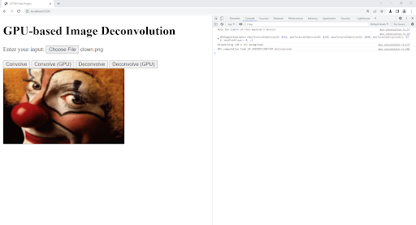

# Overview
This project delivers an application able to perform image convolution and Richardson-Lucy deconvolution within a WebGPU-enabled browser, on any machine with a GPU. main.js is the starting point for image processing functionality, importing implementations from files in the modules directory. The project folder also includes decon_imagej.py, the benchmarking script for the ImageJ Ops implementations, as well as benchmark_data.pdf, containing the benchmarking data. clown.png from the ImageJ Sample Repository [6] is included as a convenient sample image for testing in the browser or in ImageJ Ops. Finally, note the tests folder, containing scripts that can be used to unit test the CPU implementations. To run these yourself, run node tests/<name_of_script>.js.
# Cloning the Repository
Relevant code, and a sample image copied from the ImageJ Sample Repository [1], can be found in the FinalProject759 directory of my repo759 class repository. This repository is linked in the abstract. The below steps should be executed from within the FinalProject759 folder.
Installing a WebGPU-enabled Browser
As of this writing, no popular browsers support WebGPU in production releases. This is partially because WebGPU is still experimental, but also because there are many remaining security concerns in the current implementation [1]. Therefore, this project can only be run within a developer browser. Firefox Nightly purportedly supports WebGPU as of this writing, but I had success working with Chrome Canary [8].

# Configuring Chrome Canary
Once installed, Chrome Canary requires WebGPU flags to be set before it will run WebGPU code. These flags can be found by visiting chrome://flags/ within Chrome Canary. By enabling both“Unsafe WebGPU” and “WebGPU Developer Features”, Chrome Canary should be able to run the project code. The enabled flags can be seen in Figure 1. Other browsers likely require similar configuration to run this project.

*Figure 1: The “Unsafe WebGPU” and “WebGPU Developer Features” flags in Chrome Canary. Chrome Canary requires these flags to be set to run WebGPU.*

# Launching Project Code
Chrome Canary must be pointed at a server to run the project code. This server can be launched in many ways [9]; I chose to use Visual Studio Code’s Live Server extension while debugging [10], but python 3 provides the easiest way to launch a server. Assuming python 3 is installed on your machine, running python -m http.server from the FinalProject759 directory should start up a sufficient server. To install Python 3, check https://wiki.python.org/moin/BeginnersGuide/Download. 

Once a server is running from the FinalProject759 directory, accessing the page http://localhost:8000/ will display the Project Code, as shown in Figure 2. Pay attention to the port, as this number may change depending on how the server is launched.

*Figure 2: The project webpage, executed in Chrome Canary.*

# Processing Images in the Browser
Once the webpage is loaded in Chrome Canary, you can load an image into Javascript using the “Choose File” button. I have provided the public domain image clown.png within the FinalProject759 directory, however any image confined within WebGPU buffer and Chrome import constraints (approximately 128 MiB) could be used instead.
	Once an image has been uploaded, it can be operated on by pressing any of the four buttons. When the algorithms have finished execution, the results will overwrite the image display, as well as the backing data. Debugging information pertaining to the operations, such as the execution time, will be displayed in the browser console (easily accessed by pressing F12). The result of a GPU convolution is displayed in Figure 3.

*Figure 3: The result of an image convolution on the GPU. Debug information can be seen in the console on the right.*

# Benchmarking in ImageJ Ops
The timing comparisons to the ImageJ Ops project made in the earlier sections are reproducible in Fiji, using the script decon_imagej.py script included in the FinalProject759 directory. Start by downloading Fiji from the Fiji website [11]. Once you extract the download and launch Fiji.app/ImageJ-<your platform>.exe, you can run decon_imagej.py using these steps:
Open clown.png or another image of choice using File → Open… 
Open the script editor using File → New → Script…
Paste the contents of  decon_imagej.py into the New_.py window.
Click the Run button in the bottom left corner of the console in the bottom pane. 
Debug information, including the execution time for convolution and deconvolution, will be displayed in the script console at the bottom of the script editor, as shown in Figure 4.

*Figure 4: The result of  decon_imagej.py in the Fiji script editor.*

# Benchmarking Results

To quantify the performance of the implemented algorithms, we benchmark against implementations from the [ImageJ Ops library](https://github.com/imagej/imagej-ops). All algorithms are run on the clown.png sample image from the [ImageJ Sample Data Repository](https://imagej.net/images/), which has been included in the final project repository. The ImageJ Ops implementations are taken from Fiji version 2.9.0/1.53t, and the browser-based implementations are run in Chrome Canary 110.0.5464.0. All implementations are run on Windows 10, with an AMD Ryzen 7 3700X CPU and a NVIDIA GTX 1060 3GB GPU. Execution times are defined as the average over ten executions.
The serial and parallel convolution algorithms are compared against the ImageJ Ops convolution algorithm in Table 1. From the benchmarks, it is clear that the parallel implementation is over four times as fast as the serial implementation, and nearly twice as fast as the ImageJ Ops implementation.

| Implementation | ImageJ Ops | Serial | Parallel |
| - | - | - | - |
| Time to Completion | 22.6 ms | 55.2 ms | 12.14 ms |
| Fold Increase (vs. Ops) | 1.0x | 0.409x | 1.86x |

*Table 1. Image convolution benchmarks.*

The serial and parallel deconvolution algorithms are compared against the ImageJ Ops deconvolution algorithm in Table 2. From the benchmarks, it is clear that the parallel implementation is over twenty times as fast as the serial implementation and the ImageJ Ops implementation.

| Implementation | ImageJ Ops | Serial | Parallel |
| - | - | - | - |
| Time to Completion | 3298.8 ms | 3201.0 ms | 153.87 ms | 
| Fold Increase (vs. Ops) | 1.0x | 1.03x | 21.4x |

*Table 2. Image deconvolution benchmarks.*
